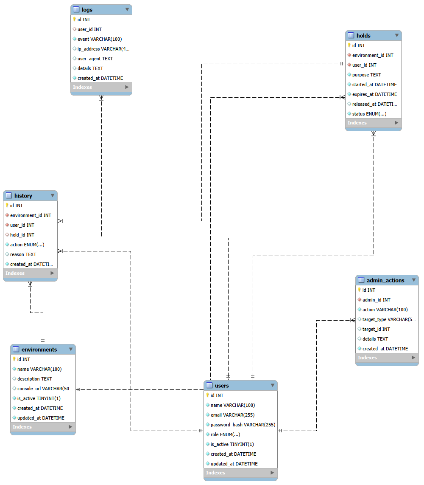

# EnvBoard

A shared test environment reservation system. Teams claim, extend, and release environments through a live board — no more Slack messages asking *"is staging free?"*

---

## What it does

| Feature | Description |
|---|---|
| **Live board** | Every environment's status updates in real time across all open tabs via Server-Sent Events |
| **Claim & release** | Grab an environment for a set duration (15 min – 8 hrs), extend before expiry, or release early |
| **Hold limits** | A user can hold at most 2 environments at a time; simultaneous claims are race-safe |
| **Admin controls** | Create/edit/toggle environments, force-reclaim any hold with a mandatory reason, manage users |
| **Audit trail** | Hold events, login events, and admin actions are all logged and viewable in the UI |

---

## Tech stack

| Layer | Technology |
|---|---|
| Backend | Go 1.22+ · `net/http` standard library |
| Database | MySQL 8.0 |
| Auth | JWT (HS256) + bcrypt |
| Live updates | Server-Sent Events (SSE) |
| Frontend | React 18 · Vite · Tailwind CSS v4 · React Router v6 |

---

## Getting started

### Prerequisites

- **Go** 1.22+
- **Node.js** 18+ and **npm**
- **MySQL** 8.0+

---

### 1. Create the database

Run `schema.sql` against your MySQL instance:

```bash
mysql -u root -p < schema.sql
```

Or in MySQL Workbench / CLI:

```sql
SOURCE /path/to/schema.sql;
```

---

### 2. Configure the database connection

Edit the DSN in `main.go`:

```go
dsn := "user:password@tcp(127.0.0.1:3306)/envboard?parseTime=true&loc=Local"
```

> **`loc=Local` is required.** It aligns Go's `time.Now()` with MySQL's `NOW()`. Without it, expiry comparisons break on machines whose local timezone differs from UTC.

---

### 3. Seed the first admin user

```bash
go run cmd/seed/main.go
```

Creates `admin@test.com` / `password123`. Change the password after first login.

---

### 4. Start the backend

```bash
go run main.go
```

API is now live at `http://localhost:8080`.

---

### 5. Install frontend dependencies

```bash
cd frontend
npm install
```

---

### 6. Start the frontend

```bash
npm run dev
```

App opens at `http://localhost:5173`. The Vite dev server proxies all `/api` requests to `:8080`.

---

## How it works

### Request flow

```
Browser  →  React (Vite :5173)  →  [/api proxy]  →  Go (net/http :8080)  →  MySQL
```

Every API call from the frontend hits `/api/...`, which Vite proxies to the Go backend at `:8080`. The backend is a single binary with no external dependencies beyond MySQL.

### Authentication

1. User submits email + password to `POST /api/auth/login`
2. Backend verifies bcrypt hash, returns a signed JWT
3. Frontend stores the JWT in `localStorage` and attaches it as `Authorization: Bearer <token>` on every subsequent request
4. For SSE (which can't send custom headers), the token is passed as `?token=<jwt>` in the query string

### Live board

The board page opens a persistent SSE connection to `GET /api/board/stream`. The Go handler:

1. Immediately sends the current board state
2. Polls MySQL every 2 seconds and pushes updates as SSE events
3. Each connected browser tab runs its own goroutine — no broker or shared state needed

The frontend `useSSE` hook automatically reconnects after 3 seconds if the connection drops. The manual **Refresh** button force-reconnects immediately.

### Claiming an environment (race safety)

```
1. BEGIN transaction
2. SELECT id FROM holds WHERE environment_id = ? AND status = 'active' FOR UPDATE
   → if row found: ROLLBACK, return ErrEnvTaken
3. INSERT INTO holds ...
4. INSERT INTO history ... (action = 'claimed')
5. COMMIT
```

`SELECT FOR UPDATE` serializes concurrent claims at the DB level — two users clicking Claim at the same time will never both succeed.

### Hold expiry

There is no background job. Holds expire passively: every query that checks hold status includes `AND expires_at > NOW()`. An expired hold is invisible to the board and cannot be extended or released — it is effectively gone.

---

## User roles

| Role | Can do |
|---|---|
| **Member** | View board, claim/extend/release their own holds, view history |
| **Admin** | Everything above + manage environments, manage users, force-reclaim any hold, view audit logs |

---

## API overview

Base URL: `http://localhost:8080/api`  
Protected routes require `Authorization: Bearer <token>`.

| Method | Route | Auth | Description |
|---|---|---|---|
| POST | `/auth/login` | — | Login, returns JWT + user object |
| GET | `/board` | member | Board snapshot |
| GET | `/board/stream` | member | SSE live board (`?token=` supported) |
| GET | `/environments/:id/history` | member | Hold history for one environment |
| POST | `/holds` | member | Claim an environment |
| PATCH | `/holds/:id/extend` | owner | Add minutes to a hold |
| DELETE | `/holds/:id/release` | owner | Release hold early |
| POST | `/holds/:id/reclaim` | admin | Force-reclaim any hold |
| GET | `/environments` | admin | List all environments |
| POST | `/environments` | admin | Create environment |
| PATCH | `/environments/:id` | admin | Update name / description / URL |
| PATCH | `/environments/:id/status` | admin | Toggle active / inactive |
| GET | `/admin/users` | admin | List users |
| POST | `/admin/users` | admin | Create user |
| PATCH | `/admin/users/:id/role` | admin | Change role (member ↔ admin) |
| PATCH | `/admin/users/:id/status` | admin | Activate / deactivate |
| POST | `/admin/users/:id/reset-password` | admin | Reset password |
| GET | `/admin/logs` | admin | System event log |
| GET | `/admin/actions` | admin | Admin action audit log |

Full request/response shapes: [`docs/API_CONTRACT.md`](docs/API_CONTRACT.md)

---

## Database schema

### ER Diagram



---

### Tables

#### `users`
Stores every account. Admin creates all users — no self-service signup.

| Column | Type | Notes |
|---|---|---|
| `id` | INT PK | Auto-increment |
| `name` | VARCHAR(100) | Display name |
| `email` | VARCHAR(255) | Unique — used as login identifier |
| `password_hash` | VARCHAR(255) | bcrypt hash — plain text never stored |
| `role` | ENUM(`member`, `admin`) | DB-enforced; only two valid values |
| `is_active` | TINYINT(1) | 0 = deactivated; history rows preserved |
| `created_at` | DATETIME | Set on insert |
| `updated_at` | DATETIME | Auto-updated by MySQL on every change |

---

#### `environments`
The test environments shown on the board. Admin-managed.

| Column | Type | Notes |
|---|---|---|
| `id` | INT PK | Auto-increment |
| `name` | VARCHAR(100) | Unique — board display label |
| `description` | TEXT | Optional |
| `console_url` | VARCHAR(500) | Optional link to the environment's console |
| `is_active` | TINYINT(1) | 0 = hidden from board (unavailable) |
| `created_at` | DATETIME | |
| `updated_at` | DATETIME | |

**Status is computed at read time — not stored:**
- `is_active = 0` → `unavailable`
- `is_active = 1`, no active hold → `available`
- `is_active = 1`, active hold exists → `in_use`

---

#### `holds`
One row per reservation. Tracks the full lifecycle of every claim.

| Column | Type | Notes |
|---|---|---|
| `id` | INT PK | Auto-increment |
| `environment_id` | INT FK | → `environments.id` |
| `user_id` | INT FK | → `users.id` |
| `purpose` | TEXT | Why the user claimed it |
| `started_at` | DATETIME | Set on claim |
| `expires_at` | DATETIME | Compared with `NOW()` on every read |
| `released_at` | DATETIME (nullable) | Set only when ended early (release or reclaim) |
| `status` | ENUM(`active`, `released`, `expired`, `reclaimed`) | Informational — authoritative check is always `status = 'active' AND expires_at > NOW()` |

**Indexes:** `(environment_id, status)`, `(user_id, status)`

---

#### `history`
Append-only audit trail. Never updated or deleted.

| Column | Type | Notes |
|---|---|---|
| `id` | INT PK | Auto-increment |
| `environment_id` | INT FK | → `environments.id` |
| `user_id` | INT FK | Who performed the action |
| `hold_id` | INT FK (nullable) | → `holds.id` |
| `action` | ENUM(`claimed`, `extended`, `released`, `expired`, `reclaimed`) | |
| `reason` | TEXT (nullable) | Mandatory only for `reclaimed`; NULL for all others |
| `created_at` | DATETIME | |

**Index:** `(environment_id)` — used by history page queries

---

#### `logs`
System-level events: logins, auth failures, rate limit hits.

| Column | Type | Notes |
|---|---|---|
| `id` | INT PK | Auto-increment |
| `user_id` | INT FK (nullable) | NULL for failed logins (no authenticated user yet) |
| `event` | VARCHAR(100) | e.g. `login_success`, `login_failed`, `rate_limit_hit` |
| `ip_address` | VARCHAR(45) | Supports IPv6 (max 39 chars) |
| `user_agent` | TEXT (nullable) | Browser user-agent string |
| `details` | TEXT (nullable) | Extra context where useful |
| `created_at` | DATETIME | |

**Indexes:** `(user_id)`, `(created_at)`

---

#### `admin_actions`
Every management action an admin performs on users or environments.

| Column | Type | Notes |
|---|---|---|
| `id` | INT PK | Auto-increment |
| `admin_id` | INT FK | → `users.id` (the admin who acted) |
| `action` | VARCHAR(100) | e.g. `create_user`, `update_role`, `reclaim_hold` |
| `target_type` | VARCHAR(50) (nullable) | `user` or `environment` |
| `target_id` | INT (nullable) | ID of the affected user or environment |
| `details` | TEXT (nullable) | Human-readable summary of what changed |
| `created_at` | DATETIME | |

**Index:** `(admin_id)`

> A force-reclaim writes to **both** `admin_actions` (admin audit log) and `history` (environment event log).

---

## Key design decisions

| Concern | Decision | Why |
|---|---|---|
| Race-safe claim | `SELECT FOR UPDATE` in a transaction | MySQL serializes concurrent claims at the DB layer — no application-level locking needed |
| Hold expiry | `WHERE expires_at > NOW()` at read time | No background job or cron; expired holds simply become invisible |
| Live updates | SSE + MySQL polling every 2s | No message broker needed; Go goroutines are cheap enough for the expected load |
| Auth | Stateless JWT | Works across multiple backend replicas; no session store needed |
| SSE auth | `?token=` query param | `EventSource` API does not support custom headers |
| Timezone | `loc=Local` in MySQL DSN | Prevents `time.Now()` vs `NOW()` skew when the server's local timezone differs from UTC |

---